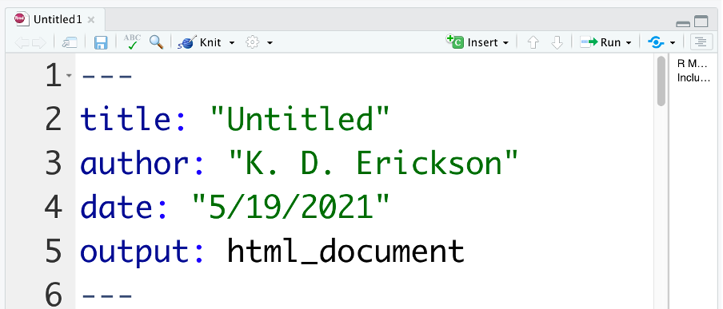

# What is R Markdown? 

R Markdown allows you to combine your R code, figures, analysis, and long-form notes all in one place. Some people even write their entire manuscripts in RMarkdown! 

Here is an example of a Markdown output: 
[Example HTML page](https://kerickson22.github.io/share/exploring_vital_rates_M.html)

# Why R Markdown?

Keep notes about what and *why* you are doing something right along with your code 

Useful for:

- Keeping a coding notebook
- Sharing with collaborators (especially those who don't use R!)
- Publish reports/summaries
- Share code snippets/results on your website
- Teaching
- Visualizing large plots
- Keeping track of figures

# Orientation to a R Markdown file

## The header
An R Markdown file (*.Rmd) starts with a YAML header that sets certain document properties:



`output:` controls what type of document your markdown file will render to: 

- html_document 
- html_notebook
- pdf_document
- word_document

Because Markdown was originally developed for html, there are the most options available for html documents. 

RStudio includes a bunch of commonly used options to select from in the Output Options... menu: 

{width=30%}
{width=30%}
{width=30%}
Selecting choices and clicking ok will update the YAML header for you. 


```{r setup, include=FALSE}
knitr::opts_chunk$set(
	echo = TRUE,
	message = FALSE,
	warning = FALSE
)
library(knitr) #Includes some helpful functions for markdown 
```

## R Markdown

This is an R Markdown document. Markdown is a simple formatting syntax for authoring HTML, PDF, and MS Word documents. For more details on using R Markdown see <http://rmarkdown.rstudio.com>.

When you click the **Knit** button a document will be generated that includes both content as well as the output of any embedded R code chunks within the document. You can embed an R code chunk like this:

```{r cars}
summary(cars)
```

## Including Plots

You can also embed plots, for example: When you click the **Knit** button a document will be generated that includes both content as well as the output of any embedded R code chunks within the document. You can embed an R code chunk like this:
```{r plot, echo=FALSE, fig.cap="A figure caption."}
plot(cars, pch=19)
```


Note that the `echo = FALSE` parameter was added to the code chunk to prevent printing of the R code that generated the plot.

## Including multiple plots on the same line

To control how many plots are shown in one row, use 
`fig.show="hold"` and `out.width="XX%$`, where XX is 50% if you want two per line, 33% for three, 25% for 4, etc. 
```{r multiple plots, fig.show="hold", out.width="50%"}

plot(cars, pch=19)
plot(pressure, pch=19, type='b')
hist(cars$speed, col="grey")
hist(pressure$temperature, col="lightblue")
```

What if we use par?
```{r multiple plots2 }

par(mfrow=c(2,2))
plot(cars, pch=19)
plot(pressure, pch=19, type='b')
hist(cars$speed, col="grey")
hist(pressure$temperature, col="lightblue")
```

## Including tables
```{r a table}
kable(head(pressure), caption = "This is my table caption.", digits=2) 
#digits: controls how many digits to display in the table
```


## Writing out equations 

You can make use of $\LaTeX$ to write out mathematical equations, either inline like so: $y = \beta_0 + \beta_1 x_1 + \beta_2 x_{1}^2$

or on a separate line in display mode: 

$$ \int_{-\infty}^{\infty} \mu_x dx $$


See https://detexify.kirelabs.org/classify.html for a helpful link for looking up $\LaTeX$ symbols, either by drawing them or looking through a chart. And see https://www.overleaf.com/learn/latex/Learn_LaTeX_in_30_minutes for a brief intro to the power of $\LaTeX$ 
